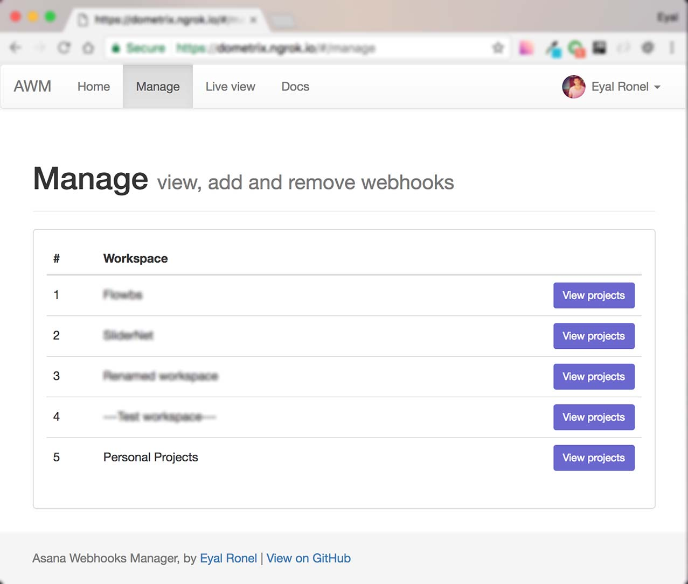
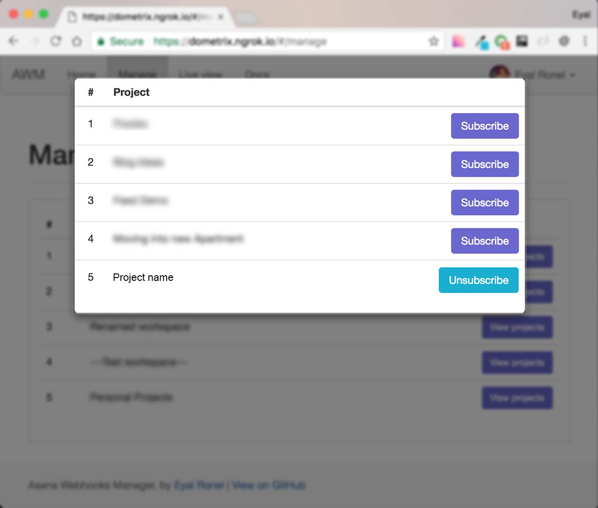
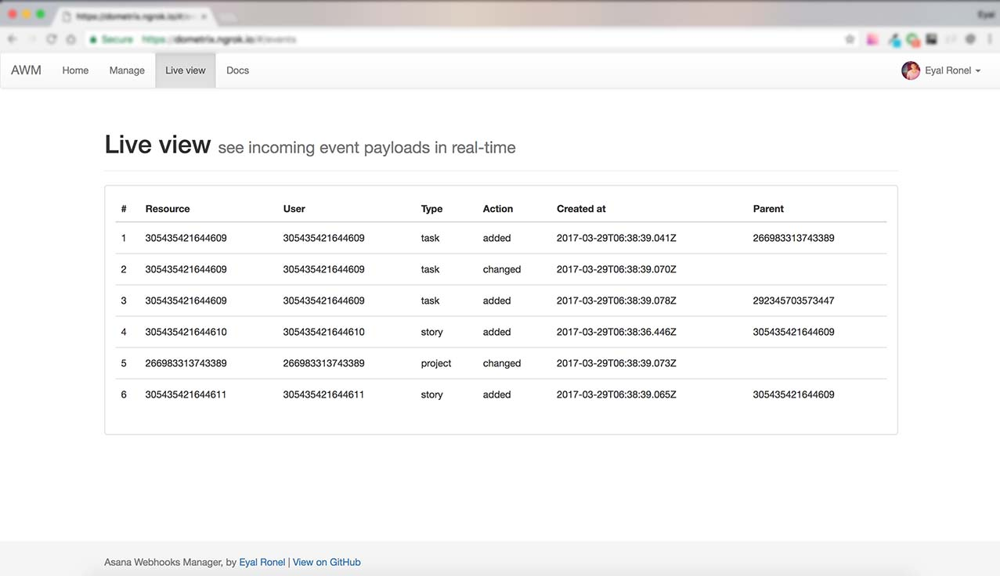

[](https://travis-ci.org/EyalRonel/asana-webhooks-manager)
[](https://coveralls.io/github/EyalRonel/asana-webhooks-manager?branch=master)

# Asana Webhooks Manager and Event Handler (AWM)
AWM is an open-source, webhooks management and event handling server for [Asana](http://www.asana.com)  
Consider AWM as your starting point (and time saver) for creating your own real-time applications on top of Asana's webhooks machanism.  

  
  
  

# Out-of-the-box support for:  
  - Asana login (OAuth)  
  - View, add and remove webhooks subcriptions for Projects accross all workspaces  
  - Receive and view incoming events payloads from Asana in real-time  
  
## Installation  

AWM requires [Node.js](https://nodejs.org/) v6.9+ to run.  
Download, extract and run the server  
```sh
$ cd asana-webhooks-manager
$ node server.js
```
